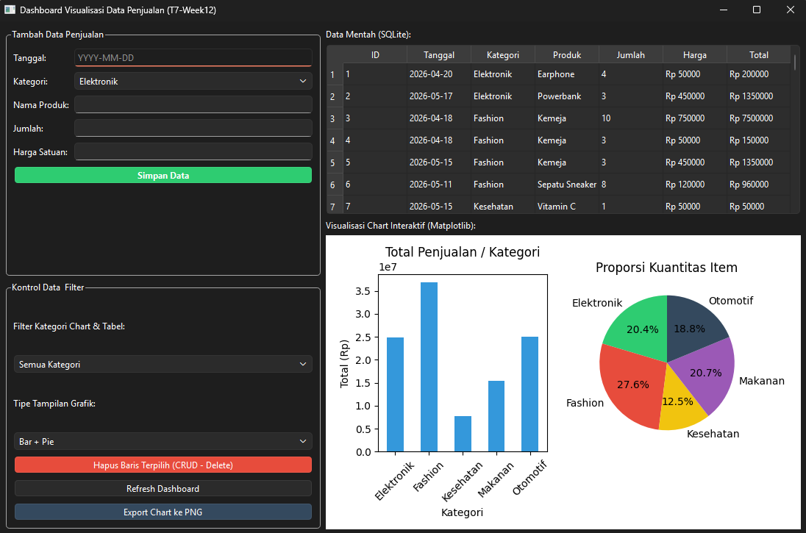

## Tugas 7 (Week 12) - Dashboard Visualisasi Data

Aplikasi dashboard visualisasi data dibangun menggunakan PySide6 sebagai GUI framework, Matplotlib untuk rendering grafis, serta SQLite & Pandas untuk penyimpanan data.

## Identitas Diri
* Nama: Kanda Rifqi Alfaz
* NIM: F1D02310064
* Mata Kuliah: Pemrograman Visual

---

## Fitur Aplikasi & Pemenuhan Rubrik
1. Matplotlib di PySide6 (25%): Grafik di-render langsung di dalam Layout aplikasi utama menggunakan objek FigureCanvasQTAgg, bukan via window eksternal (plt.show()).
2. Pengolahan Data (20%): Mengintegrasikan modul sqlite3 dan pemrosesan agregasi data (groupby, sum()) menggunakan library Pandas DataFrame.
3. Filter & Update Chart Interaktif (20%): Grafik dan tabel akan otomatis terupdate secara dinamis (real-time) ketika user mengganti filter kategori combo-box atau memilik opsi tipe grafik.
4. Tabel & Layout Dashboard (20%): Menggunakan komponen QTableWidget untuk menyajikan visualisasi data mentah secara rapi dan layout bersifat dinamis (responsive sizing).
5. Tombol Refresh & Export: Menyediakan tombol refresh manual serta fitur export grafik ke file eksternal berkstensi .png melalui QFileDialog.
6. Fitur Bonus (Nilai Lebih): Implementasi penuh operasi database CRUD (Create via Form Input data, Read dari tabel SQLite, dan Delete baris data terpilih).

---

## Struktur Basis Data (SQLite)
Aplikasi memanfaatkan file local database database.db dengan skema tabel penjualan sebagai berikut:

| Nama Kolom | Tipe Data | Deskripsi |
| :--- | :--- | :--- |
| id | INTEGER (PK) | Auto increment identifier |
| tanggal | TEXT | Tanggal transaksi format YYYY-MM-DD |
| kategori | TEXT | Klasifikasi jenis komoditas |
| produk | TEXT | Nama item komoditas spesifik |
| jumlah | INTEGER | Kuantitas item terjual |
| harga | REAL | Nilai harga satuan item |
| total | REAL | Hasil kalkulasi jumlah * harga |

---

## Screenshoot
